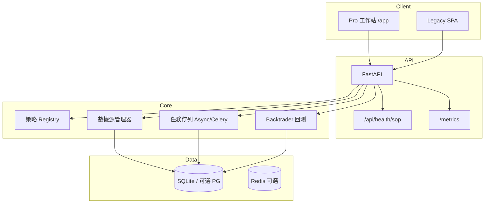
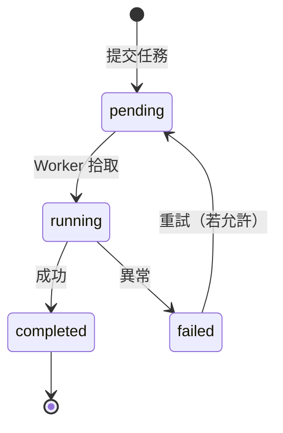
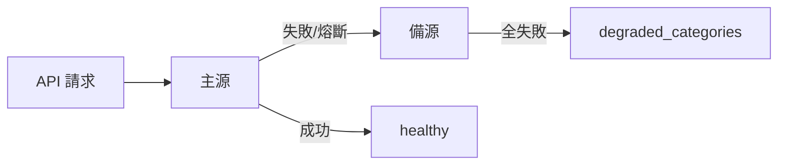

# 生產就緒改進路線圖

> **版本**: v1.0 | **最後更新**: 2026-06-03  
> 本文將外部架構評審常見建議與 **stock-quant 現況**對照，標註已完成、進行中與建議優先級，避免重複建設。

**相關文檔**：[運維 SOP 總覽](runbooks/README.md) · [ROADMAP](ROADMAP.md) · [ARCHITECTURE_RESTRUCTURE](ARCHITECTURE_RESTRUCTURE.md) · [策略系統](manual/05-策略系統.md)

---

## 總覽：五大面向現況

| 面向 | 現況評分 | 摘要 |
|------|----------|------|
| 1. 安全與程式碼品質 | 🟡 良好 | 策略沙箱已攔截 `eval`；ORM/Alembic 已有；CI 有 black/flake8，缺 ruff/mypy 門禁 |
| 2. 架構與效能 | 🟡 良好 | SQLite + 本地 K 線；PostgreSQL ORM 已鋪路；回測以 Backtrader 為主，向量化為漸進項 |
| 3. 測試與 CI/CD | 🟢 扎實 | 640+ 測試、ops-check、Docker 探活；外部 API Mock 可再加強 |
| 4. 文件與 DX | 🟢 改善中 | Runbook、MCP、Pro 運維 UI、策略模板已有；架構圖可集中維護 |
| 5. 運維與監控 | 🟢 良好 | `/health/sop`、`/metrics`、Prometheus、管線指標、SOP 稽核腳本 |

---

## 1. 安全性與程式碼品質

### 1.1 消除 `eval()` 風險

| 項目 | 狀態 | 說明 |
|------|------|------|
| 內建策略 | ✅ | `src/core/strategies/registry.py` 裝飾器註冊，無動態 `eval` |
| 用戶上傳策略 | ✅ | AST 白名單，**禁止 `eval`/`exec`/`__import__`**（見 `tests/test_strategy_sandbox.py`） |
| Redis 限流 | ✅ | `rate_limiter.py` 的 `eval` 為 **Redis Lua**，非 Python `eval` |

**建議（P2）**：CONTRIBUTING 已明確禁止用戶策略使用 `exec`/`__import__`；可選整合 `RestrictedPython` 僅在沙箱路徑。

### 1.2 ORM 與遷移

| 項目 | 狀態 | 說明 |
|------|------|------|
| SQLAlchemy 2.x + Alembic | ✅ | `src/core/database/models.py`、`migrations/`、`alembic.ini` |
| SQLite → PostgreSQL | 🟡 | `scripts/migrate_sqlite_to_pg.py`、P6 文檔；生產預設仍 SQLite |
| 業務查詢路徑 | 🟡 | 部分模組仍 raw SQL / `sqlite3`；宜按域逐步收斂至 ORM |

**建議（P1）**：新功能優先 ORM；為高寫入表（K 線、任務）定義遷移優先順序表。

### 1.3 型別與靜態檢查

| 項目 | 狀態 | 說明 |
|------|------|------|
| Pydantic / FastAPI models | ✅ | API 層廣泛使用 |
| mypy | 🟡 | CI `typecheck` job（**非阻斷**，先覆蓋核心模組） |
| Ruff | ✅ | CI `lint` job 已加入 `ruff check` |

**已落地（P1）**：CI 對核心路徑執行 `ruff check`；`typecheck` job 對 ops/ledger/logger 跑 `mypy`（**非阻斷**）。全倉約 1500+ 項待 `--fix` 後再擴大範圍。

---

## 2. 架構與效能

### 2.1 時間序列存儲

| 方案 | 優先級 | 說明 |
|------|--------|------|
| 維持 SQLite + 索引優化 | P0 現狀 | `index_audit`、data-pipeline Runbook 已覆蓋 |
| PostgreSQL + 分區 | P1 | 與現有 ORM 路線一致，適合中等規模 |
| TimescaleDB / ClickHouse | P2 | 百 GB+ K 線、多標的高頻再評估 |

### 2.2 回測效能

| 項目 | 狀態 | 建議 |
|------|------|------|
| Backtrader 引擎 | ✅ 現用 | 保持；熱點用 profiling 定位 |
| NumPy/Pandas 向量化 | 🟡 | 指標預計算、批量回測結果聚合可優先 |
| Numba / Rust 核心 | P3 | 僅在基準測試證明瓶頸後投入 |

### 2.3 前端現代化

| 項目 | 狀態 | 建議 |
|------|------|------|
| Pro 工作站（原生 JS + IIFE） | ✅ 現用 | 運維、任務、回測已模組化 |
| TypeScript / Vue / React | P2–P3 | 建議 **新頁面** ESM + TS 漸進，避免一次性重寫 |
| Web Components | P2 | 可與 `static/js/pro/ui/` 對齊 |

### 2.4 本地數據快照

| 項目 | 狀態 | 說明 |
|------|------|------|
| SQLite K 線 / 財報 | ✅ | 回測 `local-first`、排程增量更新 |
| Parquet 冷存 | 🟡 | 可選；大規模歷史再引入 |
| 多源降級 | ✅ | `data_sources` 健康、熔斷、MCP `sq_data_sources` |

---

## 3. 測試與 CI/CD

### 3.1 測試金字塔

```
        ┌─────────────┐
        │ E2E / UI    │  Playwright、煙霧 API
        ├─────────────┤
        │ 整合 / API  │  多數現有 640+ cases
        ├─────────────┤
        │ 單元（純函數）│  策略沙箱、ops_health、Ledger — 宜加強
        └─────────────┘
```

| 建議 | 優先級 | 行動 |
|------|--------|------|
| Ledger / 組合結算單測 | ✅ | `tests/unit/test_portfolio_ledger.py`（買賣/拆股/下市/股息） |
| 策略指標 golden tests | ✅ | `tests/unit/test_indicators_golden.py`（SMA/RSI/金叉邏輯） |
| 外部 API Mock | ✅ | `responses` + `tests/unit/test_http_mock_responses.py`；`tests/unit/` 預設阻擋外網 |
| SOP 一致性 | ✅ | `tests/test_ops_sop_consistency.py` |

### 3.2 CI 現況與缺口

| 已有 | 建議補充 |
|------|----------|
| black / isort / flake8 | ruff（可取代 flake8+isort） |
| pytest + coverage | mypy 門禁（分階段） |
| ops-check + Docker probe | PR 可選跑 `test_ops_sop_consistency` |
| ops-scheduled 週排程 | — |
| pip-audit | 維持 |

---

## 4. 文件與開發者體驗

### 4.1 架構與資料流（Mermaid）



**任務佇列生命週期（簡化）**：



**數據源降級**：



### 4.2 策略開發指南（已有）

| 資源 | 路徑 |
|------|------|
| 模板與範例 | `strategies/template_strategy.py` |
| 手冊 | [manual/05-策略系統.md](manual/05-策略系統.md) |
| 註冊機制 | `src/core/strategies/registry.py` |
| 沙箱規則 | `src/core/strategy_sandbox.py` |

**建議（P2）**：增加「策略 PR Checklist」（參數邊界、最小回測樣本、文檔一行描述）。

---

## 5. 運維與監控

### 5.1 已有能力

| 能力 | 入口 / 工具 |
|------|-------------|
| SOP 健檢 | `python main.py ops check` · `sq_ops_check` |
| HTTP 探活 | `ops probe` · `scripts/probe_health_sop_url.py` |
| 全面稽核 | `scripts/ops_audit.py` |
| 輕量健康 | `GET /api/health/sop` |
| 完整健康 | `GET /api/health/detailed` |
| Prometheus | `GET /metrics` · `prometheus-client` |
| 業務指標 | `GET /api/metrics/business` |
| 管線指標 | `pipeline_metrics` · MCP `sq_pipeline_metrics` |
| Uptime 範本 | [runbooks/monitoring/uptime-kuma.md](runbooks/monitoring/uptime-kuma.md) |

### 5.2 建議補強

| 項目 | 優先級 | 說明 |
|------|--------|------|
| 結構化 JSON 日誌 | ✅ | `SQ_LOG_FORMAT=json` → `logs/app.jsonl` |
| Sentry | ✅ | `SQ_SENTRY_DSN` + `src/integrations/sentry_setup.py`（需 `sentry-sdk`） |
| Grafana 儀表板 JSON | 🟡 | [monitoring/grafana-prometheus.example.md](runbooks/monitoring/grafana-prometheus.example.md) |
| 佇列長度進 health/sop | ✅ | `task_queue` 檢查（pending≥20 關注，≥100 異常） |

---

## 建議實施優先級（90 天）

| 優先級 | 項目 | 預估 | 依賴 |
|--------|------|------|------|
| **P0** | 維持 SOP/探活/Runbook（已做） | — | — |
| **P1** | CI 加入 ruff；mypy 非阻斷試跑 | 2–3 天 | — |
| **P1** | 外部 API 測試 Mock + `network` mark | 3–5 天 | — |
| **P1** | Ledger/策略核心單測補強 | 1 週 | — |
| **P1** | 結構化日誌選項 | 2 天 | — |
| **P2** | PostgreSQL 生產切換 Runbook 演練 | 1 週 | ORM 覆蓋度 |
| **P2** | health/sop 納入佇列與快取指標 | 3 天 | — |
| **P2** | 策略 Checklist · Grafana 範例 | ✅ 文檔 | — |
| **P2** | 前端 ESM + TS 試點（單頁） | 2 週 | — |
| **P2** | `ruff --fix` 全倉 src/core（49 項待清） | 進行中 | CI 非阻斷統計 |
| **P3** | TimescaleDB 評估 PoC | 2 週 | 數據量基準 |
| **P3** | Numba/ Rust 回測熱點 | 按需 | profiling |

---

## 與本倉庫命令對照

```bash
# 運維（生產前）
python scripts/ops_audit.py --ci
python scripts/ops_audit.py --with-probe --ci   # 需 serve

# 品質
black --check src/ tests/
python -m pytest tests/test_ops_sop_consistency.py tests/test_strategy_sandbox.py -q

# 監控（服務運行中）
curl -s localhost:8000/api/health/sop | jq .sop
curl -s localhost:8000/metrics | head
```

---

*維護：重大架構決策請更新本頁與 [ROADMAP.md](ROADMAP.md)；運維操作細節以 [runbooks/README.md](runbooks/README.md) 為準。*
