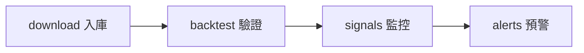

# 2. 快速開始

## 2.1 環境要求

- **Python**: 3.11+（推薦 3.12）
- **操作系統**: Windows / macOS / Linux
- **可選**: Docker、Redis

## 2.2 安裝

### 方式一：本地安裝

```bash
# 1. 克隆倉庫
git clone https://github.com/iiooiioo888/stock-quant.git
cd stock-quant

# 2. 創建虛擬環境
python -m venv venv
source venv/bin/activate  # Linux/macOS
# venv\Scripts\activate   # Windows

# 3. 安裝依賴
pip install -r requirements.txt

# 4. 複製環境變量模板
cp .env.example .env
# 編輯 .env 按需修改配置
```

### 方式二：Docker 安裝

```bash
git clone https://github.com/iiooiioo888/stock-quant.git
cd stock-quant

# 啟動（不含 Nginx）
docker compose up -d

# 啟動（含 Nginx 反向代理）
docker compose --profile proxy up -d
```

## 2.3 啟動服務

### Web 服務（推薦）

```bash
python main.py serve
# 或指定端口和 host
python main.py serve --port 8000 --host 0.0.0.0
```

啟動後訪問：
- **落地頁**: http://localhost:8000/
- **Pro 工作站**: http://localhost:8000/app
- **管理後台**: http://localhost:8000/admin
- **舊版 SPA**: http://localhost:8000/legacy/
- **API 文檔**: http://localhost:8000/docs（Swagger UI）
- **健康檢查**: http://localhost:8000/api/health

### CLI 命令

```bash
# 查看所有可用命令
python main.py --help

# 下載歷史數據
python main.py download --code 600519 --start 2020-01-01

# 運行回測
python main.py backtest --code 600519 --strategy macd --cash 100000

# 啟動實時監控
python main.py monitor
```

## 2.4 首次使用流程

量化業務建議順序：**下載數據 → 回測驗證 → 看信號 → 設預警**。系統部署與故障排查見 [運維 SOP 總覽](../runbooks/README.md)。



### 1. 下載數據

```bash
# 下載單只股票
python main.py download --code 600519 --start 2023-01-01

# 批量下載自選股
python main.py download --all
```

### 2. 運行回測

```bash
# CLI 方式
python main.py backtest --code 600519 --strategy dual_ma --cash 100000

# Web 方式：打開 http://localhost:8000/app → 回測 Tab
```

### 3. 查看信號

```bash
# CLI 方式
python main.py signals --code 600519

# Web 方式：打開信號 Tab
```

### 4. 設置預警

通過 Web UI 設置預警規則，支持通知渠道：
- Webhook
- 企業微信
- 釘釘
- Telegram

## 2.5 認證系統

- **默認管理員**: 啟動時自動創建，密碼見啟動日誌
- **演示模式**: 設置 `SQ_DEMO_MODE=true` 後，GET 請求無需登錄，寫操作需認證
- **JWT Token**: 有效期 24 小時

```bash
# 註冊新用戶（Web API）
curl -X POST http://localhost:8000/api/auth/register \
  -H "Content-Type: application/json" \
  -d '{"username": "test", "password": "test123"}'

# 登錄
curl -X POST http://localhost:8000/api/auth/login \
  -H "Content-Type: application/json" \
  -d '{"username": "test", "password": "test123"}'
```

## 2.6 在線演示

部署在 Render.com 免費方案（新加坡節點）：
- **地址**: https://stock-quant.onrender.com
- **注意**: 冷啟動約 30 秒，演示模式下寫操作需登錄
