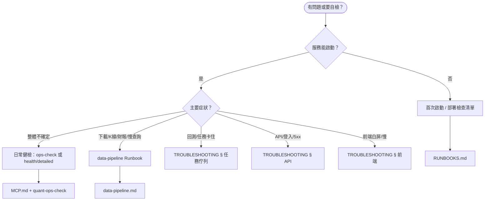

# Stock-Quant 運維 SOP 總覽

> **版本**: v1.3 | **最後更新**: 2026-06-03  
> 本頁為**唯一入口**：依場景選路徑，避免在多篇文檔間來回跳轉。

---

## 角色與場景對照

| 你是… | 典型場景 | 走這條 SOP |
|--------|----------|------------|
| 本機開發 | 第一次跑起來 | [首次啟動](#a-首次啟動本機) → [manual/02-快速開始](../manual/02-快速開始.md) |
| 日常運維 | 部署前/每週自檢 | [日常健檢](#b-日常健檢) |
| 值班 / 事故 | 頁面慢、下載失敗、任務卡住 | [事故響應](#c-事故響應) |
| 發版 | 升級或回滾 | [RUNBOOKS.md § 升級](../RUNBOOKS.md#-升級流程) |
| 數據管線 | K 線/財報/快取異常 | [data-pipeline.md](data-pipeline.md) |
| Agent / CI | Cursor、排程、GitHub Actions | [MCP 自動化 SOP](../MCP.md#cursor-sdk-自動化-cli--ci) · CI：`python main.py ops check --ci` |

---

## 決策樹（先對症再翻文檔）



---

## A. 首次啟動（本機）

**目標**：`GET /api/health` 為 200，瀏覽器可開 `/app`。

| 步驟 | 動作 | 通過標準 |
|------|------|----------|
| 1 | `pip install -r requirements.txt` | 無報錯 |
| 2 | 複製並編輯 `.env`（參考倉庫根目錄範例） | `SQ_*` 已設 |
| 3 | `python main.py serve` | 日誌顯示監聽端口 |
| 4 | `curl http://localhost:8000/api/health` | JSON 含 `status: ok` 或等價 |
| 5 | 瀏覽 `http://localhost:8000/app` | Pro 工作站可載入 |

可選 Docker：`docker compose up -d --build`（見 [README](../../README.md)）。

---

## B. 日常健檢

**頻率建議**：部署前必做；本機開發每週一次；生產可接 Cron / CI。

### 路徑 0：本機 CLI（預設，無 API key）

```bash
python main.py ops check
python main.py ops check --json      # CI 解析
python scripts/ops_health_check.py   # 同上（排程友好）
```

| 退出碼 | 含義 |
|--------|------|
| 0 | 正常 |
| 1 | 需關注 |
| 2 | 異常 |

輸出含【總覽】【各項】【建議】，規則與 MCP `sq_health.sop`、REST `health/detailed.sop`、Pro 總覽「運維狀態」卡片一致。

**CI**：`.github/workflows/ci.yml` 的 `ops-check` job 執行 `python main.py ops check --ci`（僅 `critical` 會失敗）。PR 評論由 `scripts/ci_pr_ops_comment.py` 管理；設 `OPS_PR_COMMENT_ALWAYS=1` 可在 `ok` 時也建立/更新評論。

**API 摘要**：`GET /api/status` 內嵌 `sop.verdict` / `sop.verdict_zh`（無完整 checks，詳情用 `/api/health/sop`）。

### 路徑 1：一鍵 Agent（需 CURSOR_API_KEY）

```powershell
pip install -r requirements-mcp.txt
cd scripts/cursor-agent
npm install
$env:CURSOR_API_KEY = "cursor_..."   # 勿入庫
npm run ops-check
```

| 退出碼 | 意義 | 下一步 |
|--------|------|--------|
| 0 | 檢查完成 | 閱讀報告【總覽】 |
| 1 | 啟動失敗（缺 key 等） | 見 [MCP.md](../MCP.md) |
| 2 | Agent 跑完但 run 失敗 | 加 `--verbose` 重跑 |
| 75 | 暫時性錯誤 | 稍後重試 |

Agent 建議：`sq_ops_check`（一次 SOP）→ 必要時 `sq_pipeline_metrics` / `sq_db_index_audit(apply_missing=false)`。

### 路徑 2：REST（服務已啟動時）

```bash
# 輕量 SOP（Pro 總覽/設定輪詢、CI 探活）
curl -s http://localhost:8000/api/health/sop

# 完整指標（磁碟、記憶體、Redis）
curl -s http://localhost:8000/api/health/detailed
curl -s http://localhost:8000/api/data-sources/health
```

`sop.verdict_zh` 與路徑 0 判定一致。Pro UI：

- **頂欄**：運維狀態 pill（全站 60s 輪詢，點擊進設定；狀態惡化/恢復會 Toast）
- **Cmd+K**：搜尋「運維」或快捷鍵 **O** → 運維健檢
- **`?`**：快捷鍵說明（不再開啟命令面板）
- **鍵盤 `O`**：任意頁面立即刷新 SOP 並開設定
- **通知鈴**：運維非「正常」時顯示黃/紅點；點擊進設定運維區（否則進任務中心）
- **設定**：可複製或下載 SOP JSON；背景分頁暫停 60s 輪詢
- **PR**：CI 以固定 marker **更新同一則**評論（`attention`/`critical` 才新建；恢復 `ok` 會更新既有評論）
- **Docker**：`HEALTHCHECK` 探 `/api/health/sop`（`critical` 才失敗）
- **總覽**：運維卡片 · **設定**：系統運維 (SOP) 面板 · **任務中心**：SOP 橫條

另可對照 [data-pipeline.md § 關鍵欄位](data-pipeline.md#關鍵欄位)：`pending_deferred` 應為 0；`index_audit.missing` 宜為空。

### 路徑 3：MCP 手動（IDE 內）

1. `pip install -r requirements-mcp.txt`
2. Cursor 載入 [`.cursor/mcp.json`](../../.cursor/mcp.json)
3. 對話中請 Agent 依序呼叫上述三個 `sq_*` tools

**通過標準（摘要）**

- 健康檢查無 `error` / 熔斷源過多
- 管線 `pending_deferred === 0`（批量任務結束後）
- 索引 `missing` 為空，或已排程補建（生產慎用 `apply_missing=true`）

---

## C. 事故響應

**原則**：先恢復服務可讀，再查根因；改配置前備份 `data/stock.db`。

| 順序 | 動作 | 工具 / 文檔 |
|------|------|-------------|
| 1 | 確認進程與端口 | [TROUBLESHOOTING § 快速診斷](../TROUBLESHOOTING.md#-快速診斷流程) |
| 2 | `health` + `health/detailed` | REST / `sq_health` |
| 3 | 對照症狀表 | 下方「症狀 → Runbook」 |
| 4 | 必要時重啟 | `docker compose restart app` 或重啟 `main.py serve` |
| 5 | 仍失敗 | 備份後查日誌、`grep -i error logs/` |

### 症狀 → Runbook

| 症狀 | 優先閱讀 |
|------|----------|
| 批量頁慢、日誌「數據緩存已清除」刷屏 | [data-pipeline §1](data-pipeline.md#1-掛牌批量頁面慢日誌刷屏數據緩存已清除) |
| 詳情頁財報空 | [data-pipeline §2](data-pipeline.md#2-詳情頁財報為空) |
| 查詢變慢 | [data-pipeline §3](data-pipeline.md#3-查詢變慢) |
| Yahoo 429 / 源熔斷 | [TROUBLESHOOTING § 數據源](../TROUBLESHOOTING.md#-數據源問題) |
| 回測 pending 不動 | [RUNBOOKS § 回測卡住](../RUNBOOKS.md#問題-2回測任務卡住) |
| `database is locked` | [RUNBOOKS § DB 瓶頸](../RUNBOOKS.md#問題-4數據庫寫入瓶頸) |

---

## D. 備份與升級（摘要）

完整腳本見 [RUNBOOKS.md § 備份與恢復](../RUNBOOKS.md#-備份與恢復)。

**升級最小 SOP**：備份 → `git pull` → `pip install -r requirements.txt` → 重啟 → `ops-check` 或 `health/detailed` → 抽樣回測一筆。

---

## 文檔地圖

| 文件 | 用途 |
|------|------|
| **本頁** | 場景入口、決策樹、檢查清單 |
| [RUNBOOKS.md](../RUNBOOKS.md) | 部署清單、監控、備份、效能、安全 |
| [data-pipeline.md](data-pipeline.md) | 行情/K 線/財報/快取專項 |
| [TROUBLESHOOTING.md](../TROUBLESHOOTING.md) | 症狀百科與命令片段 |
| [MCP.md](../MCP.md) | MCP 安裝、Tools、SDK 自動化 |
| [manual/02-快速開始](../manual/02-快速開始.md) | 量化業務流：下載 → 回測 → 信號 |

---

*維護提示：新增 Runbook 時在本頁「症狀 → Runbook」表加一行，並在 RUNBOOKS 目錄加鏈接。*
